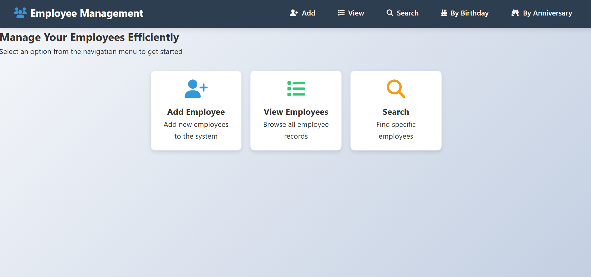
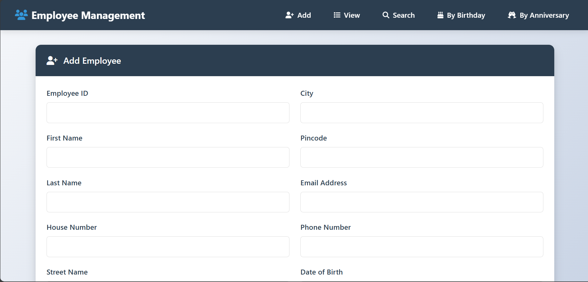
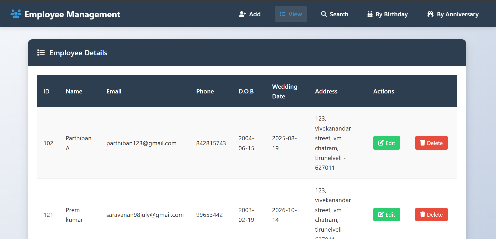
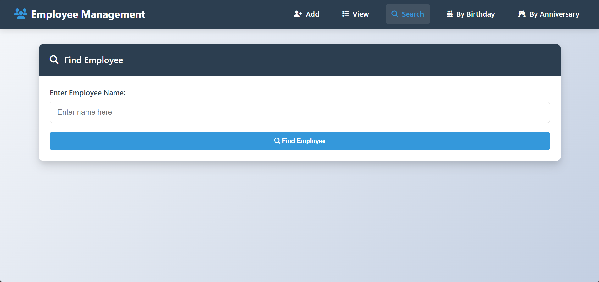
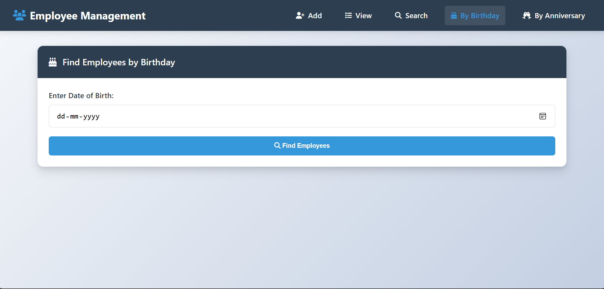
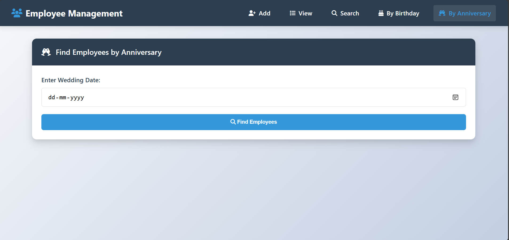

# 

  
    Employee Management System
  

  
  
  
  
  
  
  
  
  
  
  
  

---

## 📸 Screenshots

### 🌐 Dashboard Overview

### 📝 Employee Registration

### 📂 Records Management

### 🔍 Search Interface

### 🧩 Advanced Search Options
  

